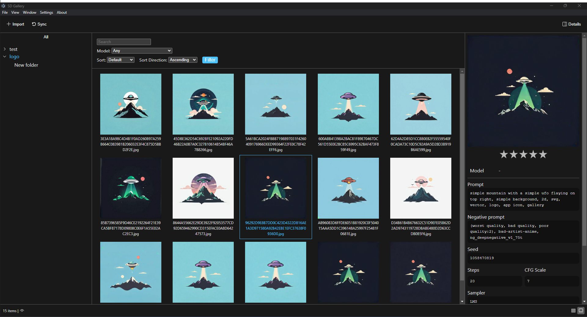

# SD Gallery

An image gallery for AI generated images.

## Installation
Download the latest version for your os from [Releases](https://github.com/amiralitaheri/sd-gallery/releases/latest).

## Features
- [x] Parse and view images metadata
- [x] Search and filter images
- [x] Rate images
- [ ] Keyboard shortcuts 
- [ ] Advance table view
- [ ] "Group by" in views
- [ ] Share images with parsed metadata
- [ ] Fuzzy search
- [ ] Link resources to HuggingFace and CivitAi
- [ ] Edit/Remove Image metadata

## Screenshot
